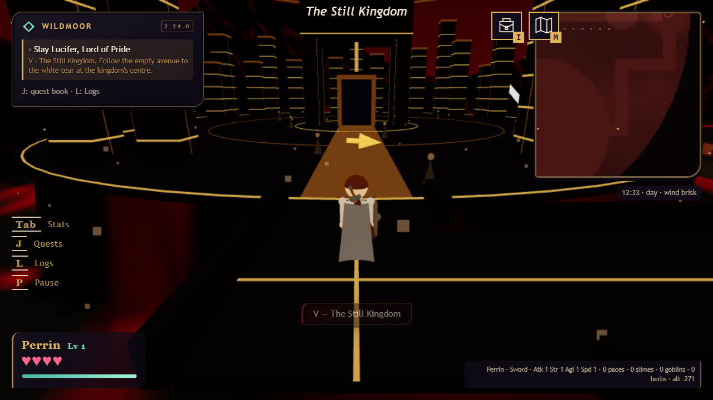
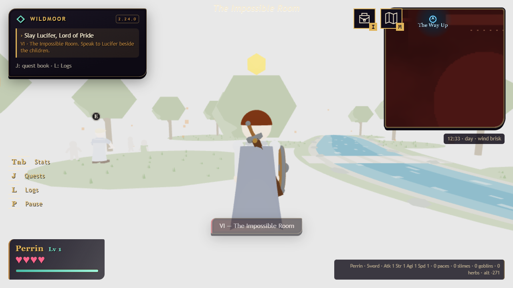
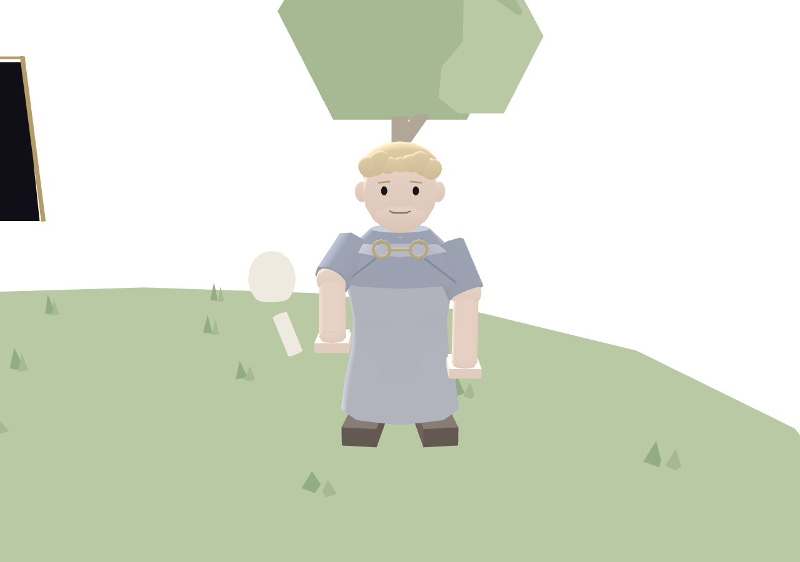
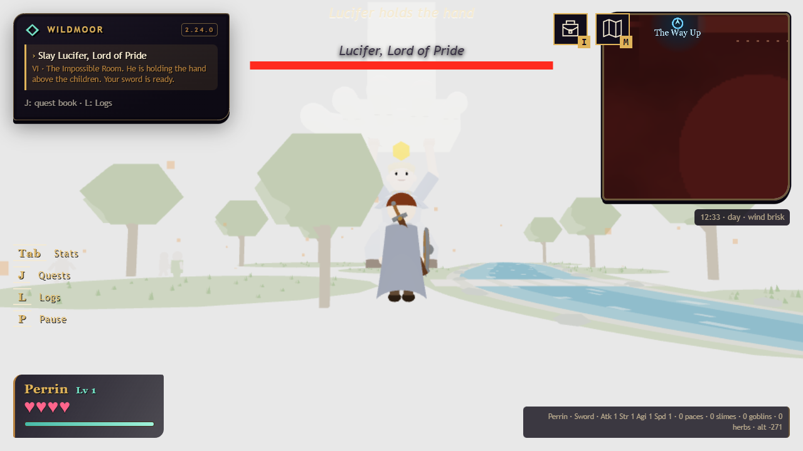

# 2.24.0 — the still kingdom

[download the game](https://github.com/phonehseng/project-game/blob/b0c2e1e2183860f6a60e6643cd8a74bae6ec5d35/legend_of_peanits_v2.24.0.html) · [full changelog](../../CHANGELOG.md)

gehenna now runs through six chapters. the long road ends in an almost empty gold kingdom, where people stand still and remember less than they should.

the portal opens into an impossible white room with a river, grass and trees in the middle. lucifer helps the children here. his robe and face use the same simple style as the rest of the cast.

lucifer has black eyes, no nose, a small smile, and a robe with a draped collar and joined clasps.

when the hand comes down, lucifer runs under it and grows to hold it up. your attacks shrink him while he keeps asking you to stop.

wildmoor also gets a steadier camera, clearer quest arrows, better enemy behavior, stronger fairy healing, quieter menus, and a fixed procession. [all changes and checks](../../CHANGELOG.md#2240--the-still-kingdom).
