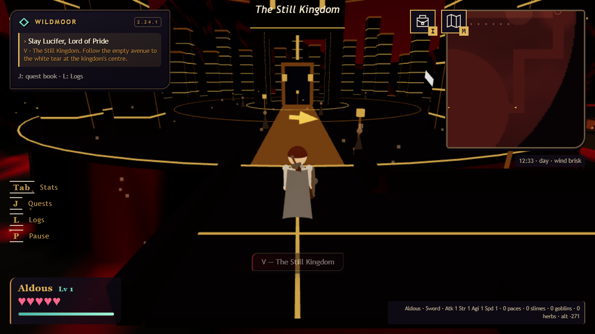
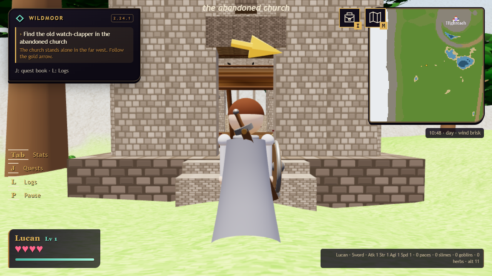

# 2.24.1 — take the road west

[download the game](../../legend_of_peanits_v2.24.1.html) · [test notes](../QA_2.24.1.md)

the still kingdom is ready to explore. more lights lead down its empty streets to the central portal and lucifer's river room. same dark colors, easier to see where you're going.

the abandoned church is now far west. the hermit sends you there before the black pool fight. its books tell more of what happened between him and hale.

story errands and boss fights now work together in a party. the person who finds a quest item still has to bring it back. story rewards are shared; optional rewards, like changing clothes, stay personal. use highlight in the quest book to point friends at an errand.

one player carries ysolde. everyone sees the same burial. movement updates are smoother, parties support 16 players, and the host can switch pvp on. the outfit and goblin quest givers have swapped places too.

also fixed shared clues, missing rewards, guest hit practice, sleeping bears, swimming targets, respawn beds, failed joins, and loading keys when browser storage is blocked.

the new lucifer surrender ending is still being worked on. this build keeps the previous ending so the kingdom update can ship now. shared fairy rescue still needs another pass.
