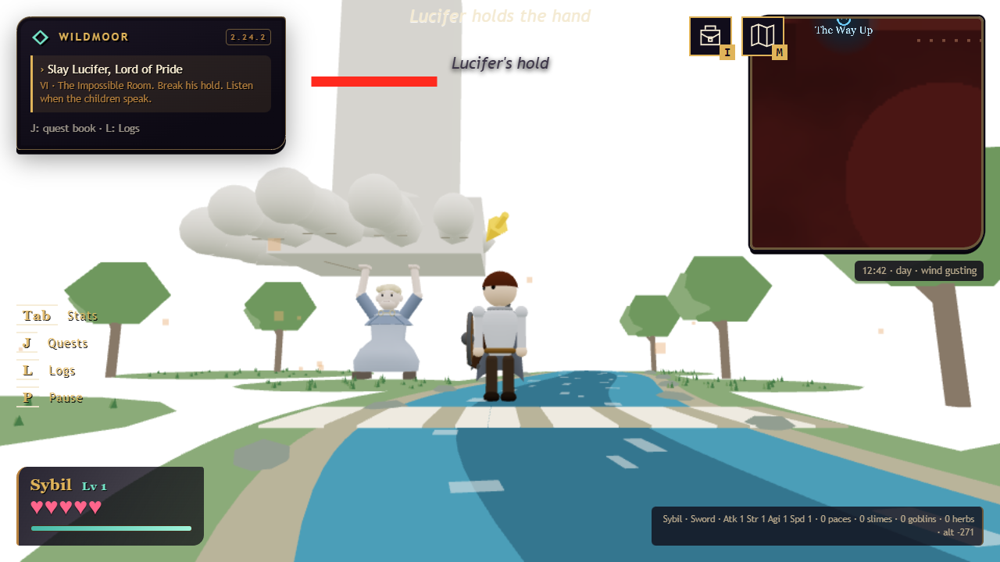
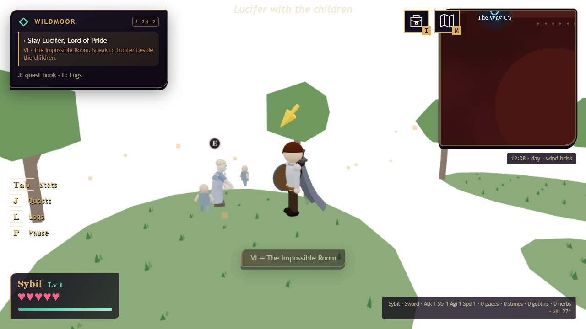

# 2.24.2 — his hands open

[download the game](https://github.com/phonehseng/project-game/releases/download/v2.24.2/legend_of_peanits_v2.24.2.html) · [test notes](../QA_2.24.2.md)

lucifer's fight now has three phases. he grows beneath god's hand, your attacks make him smaller, and the children speak between phases. he survives the ending. stay and move on are still your own choices.

the matron leaves an opening when she goes to comfort someone. kindly commits to her swings, then lowers her guard. her attacks still cannot take your last bit of health.

fairy quests stay yours. your rescues, fairy progress and rose upgrades stay separate from your friends' progress, including when you join an existing party.

if a guest stays in wildmoor for the whole run and the host chooses move on, that guest returns to single-player wildmoor. their valley progress stays, and they get no gehenna completion for a trip they didn't take.

the [save editor](../../save_editor.html) reads current save keys and keeps the newer quest, skill and story fields when you edit them.

the camera is back to its 2.23.0 behavior. the see-through character effect stays on your own screen only.
