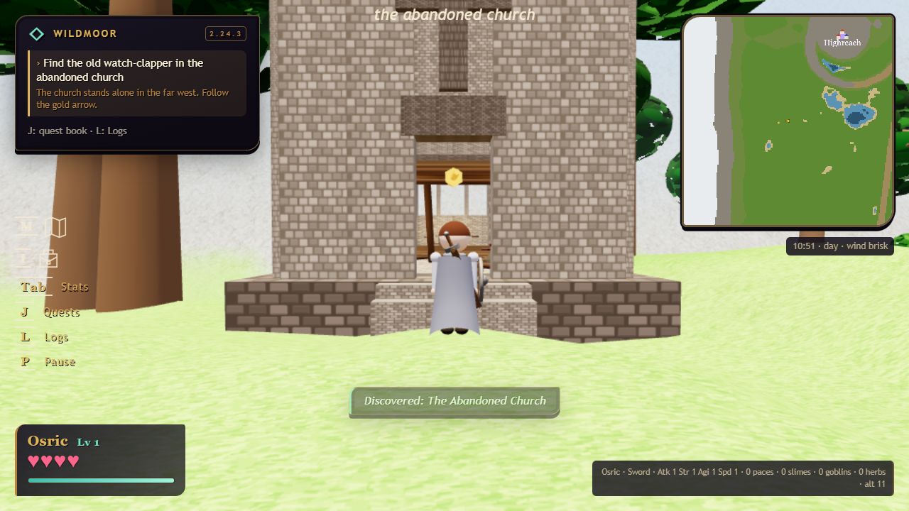

# 2.24.3 — keep the pages you found

[download the game](https://github.com/phonehseng/project-game/releases/download/v2.24.3/legend_of_peanits_v2.24.3.html) · [test notes](../QA_2.24.3.md)

one of the church pages was long enough to break loading your save. fixed that in the game and save editor. existing keys with that page work again, with the whole page still there.

map and satchel now sit above stats, quests and logs on the left. huge pointer-lock mouse jumps get ignored too.

perfect dodges now give guests the same flurry opening as the host. the warden's lash also keeps its piercing effect when it hits a guest.

shields work the same against creatures for hosts and guests. pvp still checks which way you're facing.

the robe, river and next lucifer fight changes are still being worked on. this patch gets the save repair out now.
