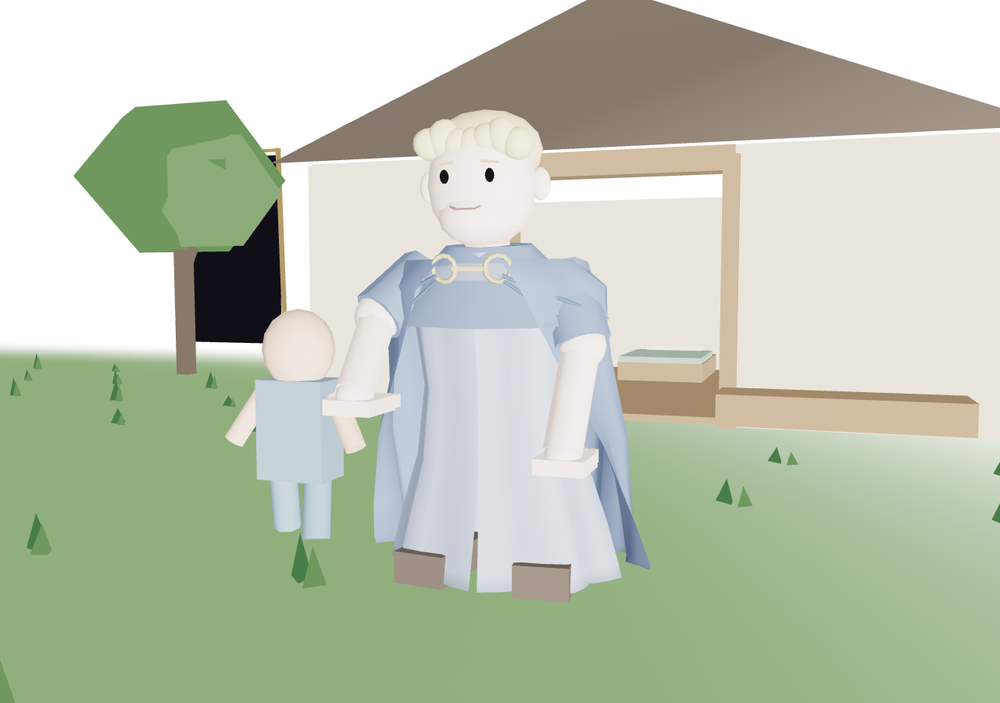

# 2.24.4 — the little river

[download the game](https://github.com/phonehseng/project-game/releases/download/v2.24.4/legend_of_peanits_v2.24.4.html) · [test notes](../QA_2.24.4.md)

lucifer has a proper long robe now, with a draped cloak that moves with him. the children have a small home beside a winding river you can actually swim in. grass and trees fill the middle; the room still disappears into white at the edges.

the hand has a shaped palm, separate fingers and a turned thumb, with warm light and ripples where the arm enters the room.

stay close too long and lucifer can let go with one hand to throw you away. watch for the windup. stamina is finite in his room and unlimited everywhere else in gehenna.

fall alone and you can retry. in a party, you watch the others until the fight ends. if everyone falls, the host chooses another attempt or a return to gehenna. earlier quests stay done.

forced camera turns are slower, and portals carry the camera with you instead of dragging it across the old world position.
