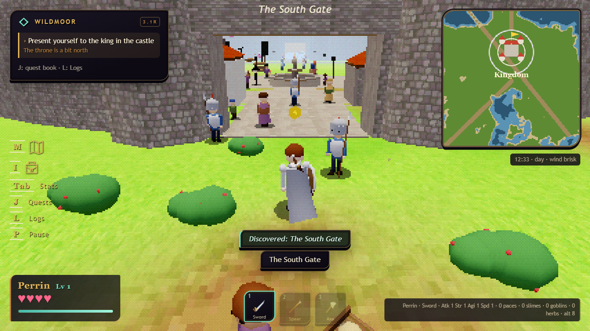
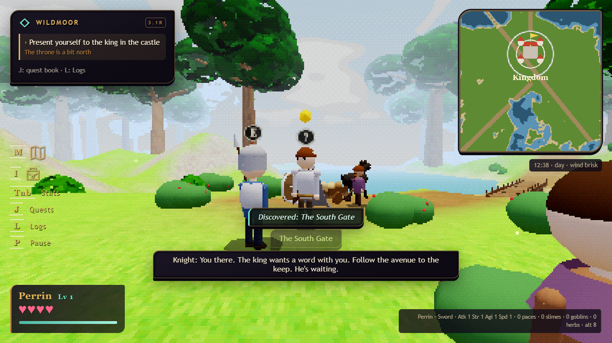
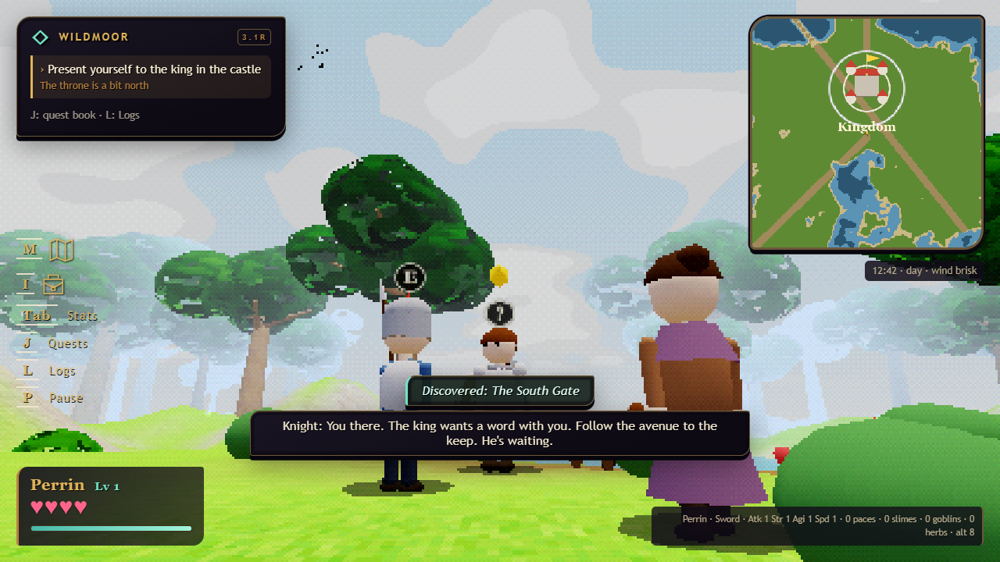
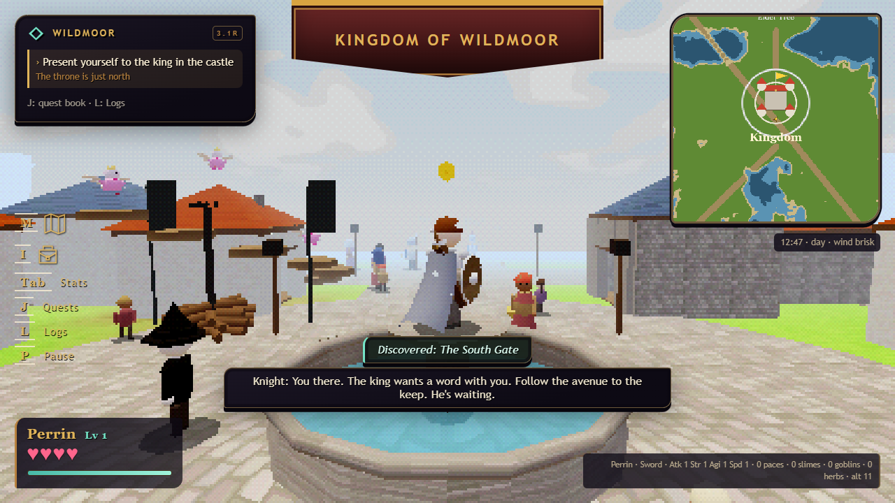
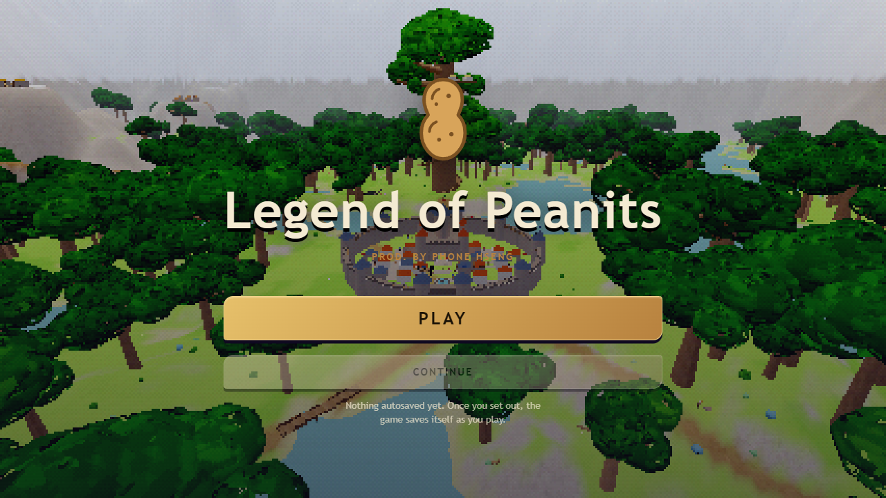
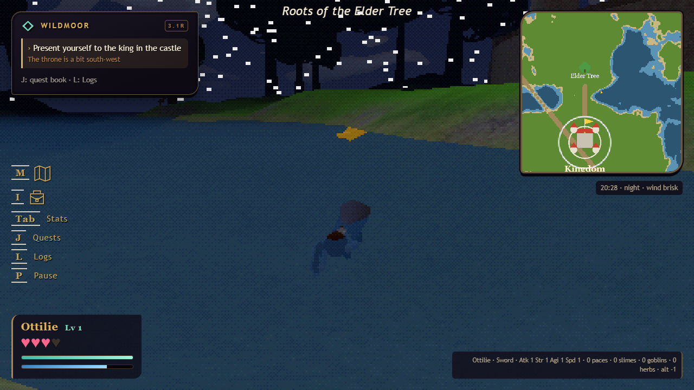

# 3.1 retro — the way it would have looked in 1998

[download the retro game](../../legend_of_wildmoor_v3.6.2_retro.html) · [test notes](../QA_3.1_retro.md) · [the main build is unchanged](../../legend_of_peanits_v3.0.html)

a second build of the same game, drawn the way a console drew it in 1998. it is the 3.0 game with nothing changed but the eye it is seen through: a 240-line picture scaled up without smoothing, 64-texel textures with no filtering, lighting worked out at the vertices, vertices snapped to the pixel grid, texture mapping that half forgets perspective, and colour cut to fifteen bits through an ordered dither. saves, quests, the valley, gehenna and multiplayer are the main build's.

the meadow south of the gate. the trees are the same trees; the sky's clouds are new, two tones cut from noise, drifting.

the kingdom's square, and the title's flight over the valley.

night, from the water at the elder tree's roots. the stars are the same points; at 240 lines each is a square.

## the dials

all in the pause menu, saved with the sound sliders:

- **picture** — 200p, 240p (default), 320p, 480p or the window's own size. the pixel grid, the wobble and the dither all follow it.
- **vertex wobble** — 0 to 3. every vertex lands on a pixel of the small picture; higher values snap to a coarser grid.
- **texture detail** — 64 texels, 128 texels, or the textures as painted (the default, since 3.2). the shrunk ones are cut to sixteen shades a channel as a palette texture was.
- **texture warp** — 0 to 1. how much of the texture mapping ignores perspective, the playstation's affine swim. off by default since 3.2: right on a wall, wrong on a floor forty metres across, and this game's floors are forty metres across.
- **pixel textures** — off gives the n64's smoothing instead.
- **15-bit colour, dithered** — the 4×4 ordered dither. off is 24-bit.
- **scanlines** — off by default.

## how the build is made

`tools/make-retro.cjs` produces the retro file from the main one by twenty-five anchored edits that only touch drawing. every anchor must match exactly once, so a change to the main build that moves one fails the build loudly rather than shipping half a renderer. `node tools/make-retro.cjs` rebuilds it.
