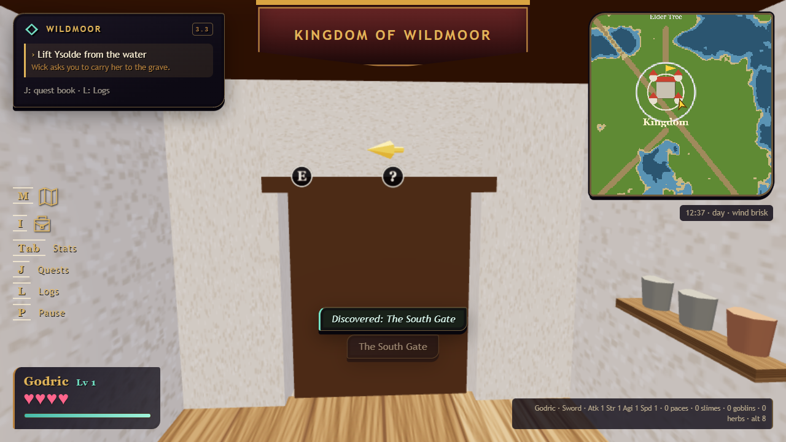
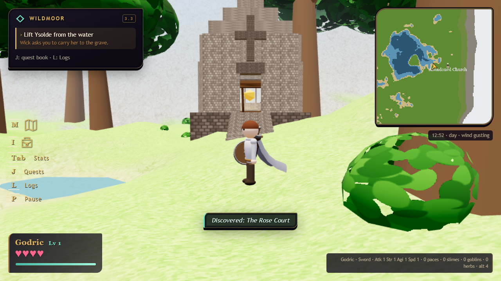
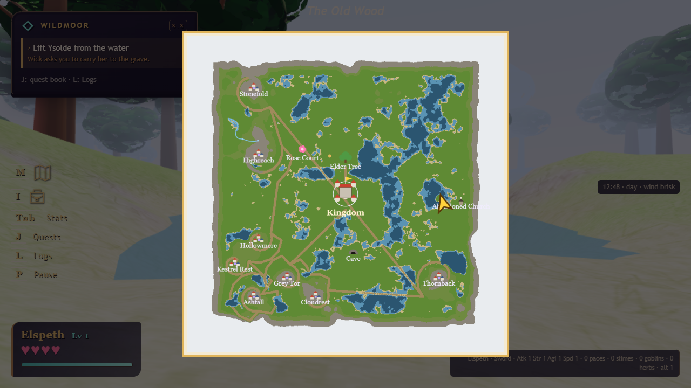
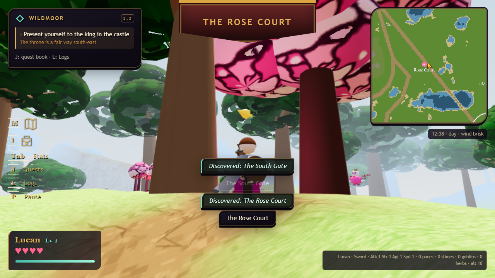
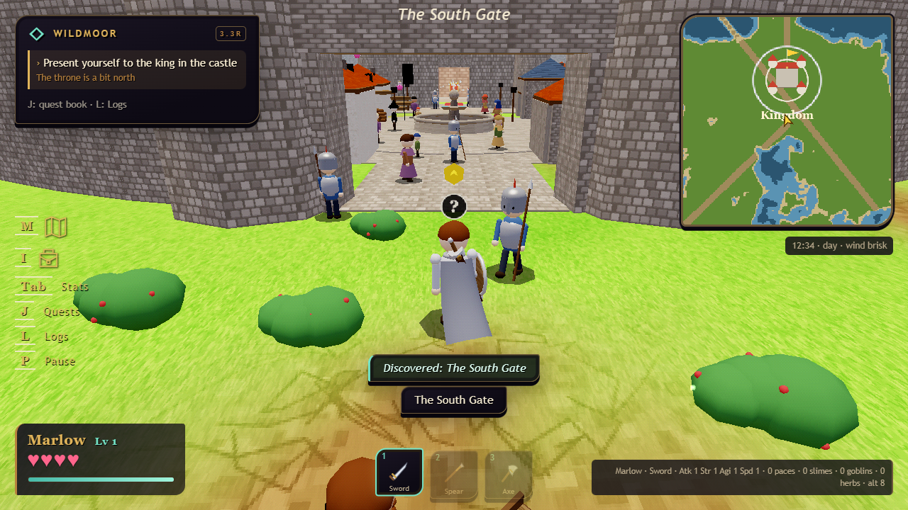

# 3.3 — the second playthrough

[download the game](../../legend_of_wildmoor_v3.8.1.html) · [the retro edition](../../legend_of_wildmoor_v3.8.1_retro.html) · [test notes](../QA_3.3.md) · [changelog](../../CHANGELOG.md)

from here the two builds share a version: the retro file is made from the main one, so everything below is in both.

ysolde's father's door lies in its own frame now. it was built with its width and thickness swapped against the wall it closes, so it stood across the doorway like a fin, and it stood on the villagers' waiting spot a metre and a half out in the street.

the abandoned church stands in the east, and it is drawn from as far as the fog allows. it was a room like any other under the room-draw rule, so it appeared thirty metres out.

the arrow on the map and the minimap is two and a half times the size, and still turns with you.

the fairy queen's tree is painted pink instead of a green painting tinted pink, which came out the colour of old moss. she and her children are painted the way a handheld painted things: a face on the front of the head, cutout wings with an ink rim, five flat colours.

the retro edition at its new defaults — the window's own picture, textures as painted, no warp — with the knights' plate shining again.

also in this release: the kindly one's shears no longer light every lamp post when she is struck; the clerk goes quiet once she has called her sister and her sister answers on her own; the matron takes any blow on her ward personally; lucifer says "my father"; a player who chose to stay never tires; the elder tree's trunk is solid from the roots up and its bark is the rail on the inner edge of the stair; the castle no longer vanishes from across the square.
