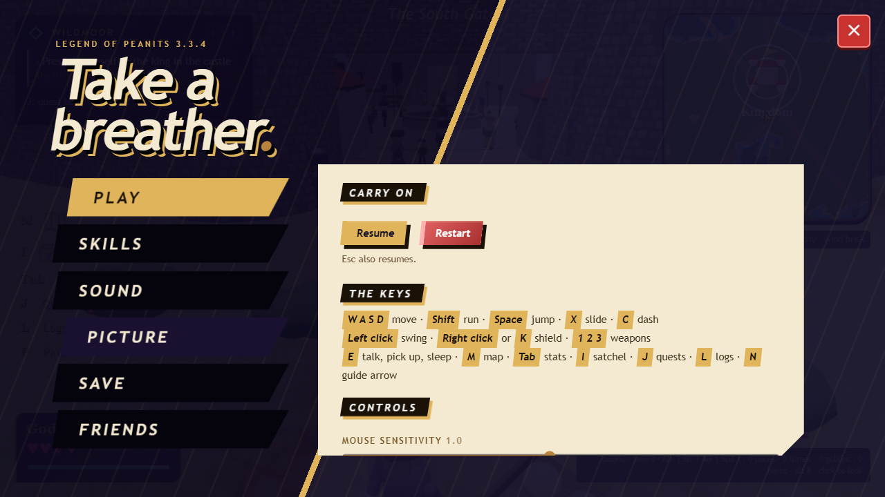
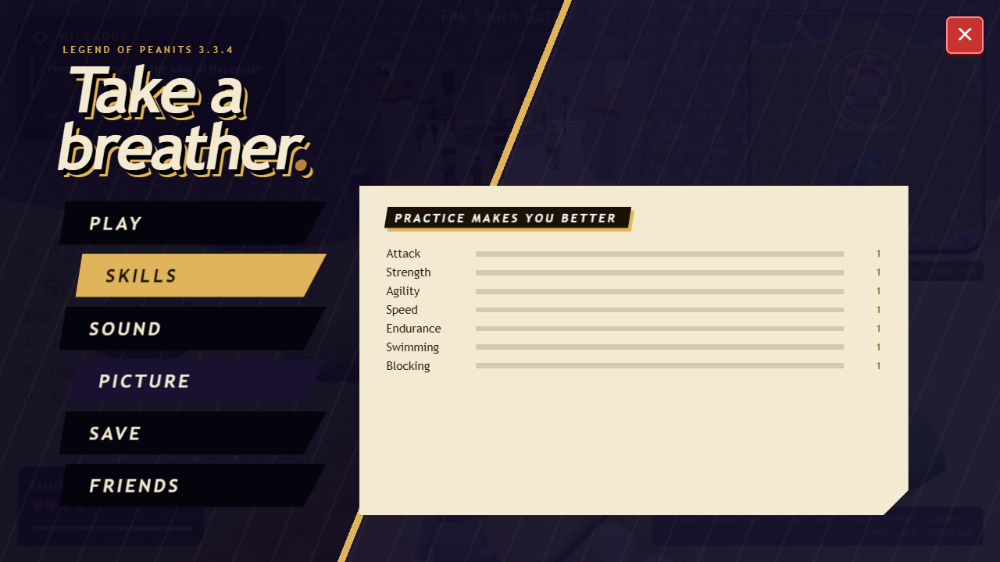
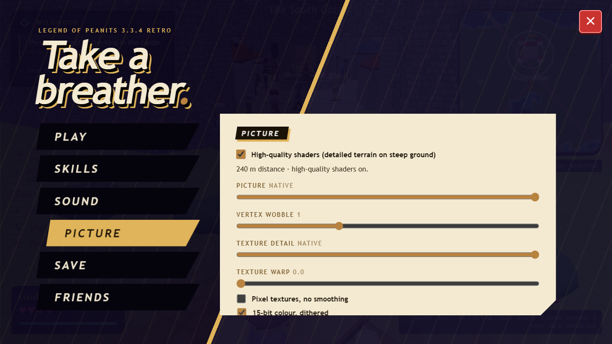
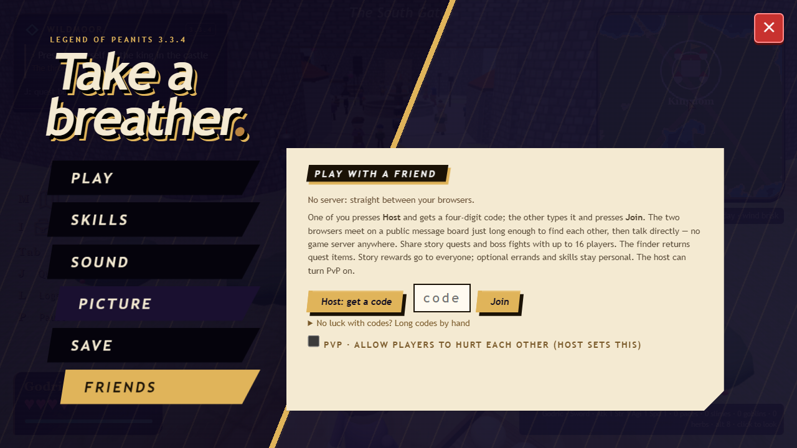
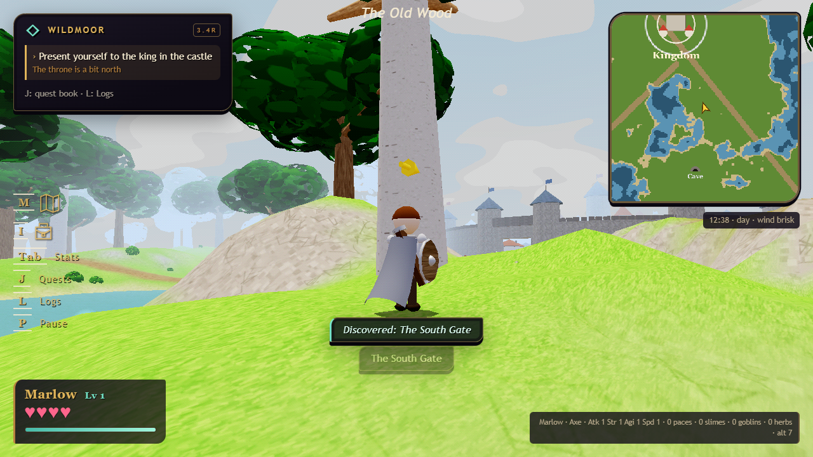

# 3.4 — the pause menu

[download the game](../../legend_of_wildmoor_v3.6.html) · [the retro edition](../../legend_of_wildmoor_v3.6_retro.html) · [test notes](../QA_3.4.md) · [changelog](../../CHANGELOG.md)

the pause menu is a menu now: a slam-in title, six tabs cut on the diagonal, and a card that slides its contents in a line at a time.

pale trees have a bark of their own, and the axe is carried rather than dragged.

also in this release, all in the [changelog](../../CHANGELOG.md): the burial soft-lock, nim's mother's errand, the herb counters, the beacon lit from the top, endurance by time, the goblin king's lull on a death, the arrest of hale, ysolde's burial, the hall's hidden sleepers, the hall floor, the flickering streets, tab for the stats without stopping the world.
