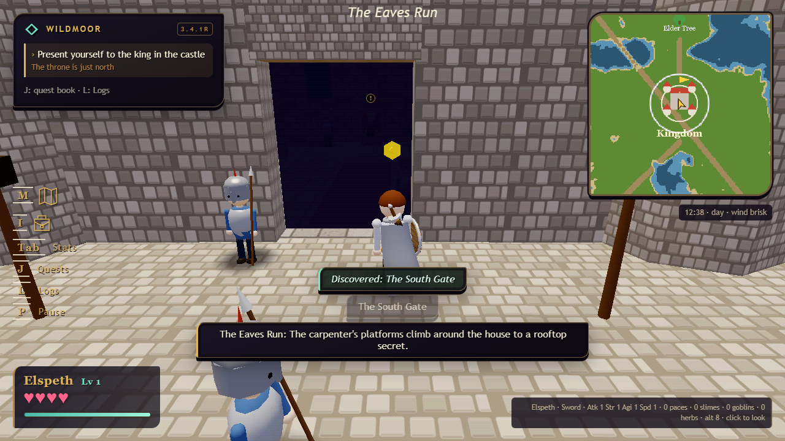
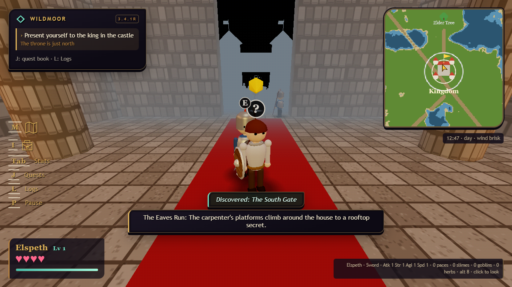
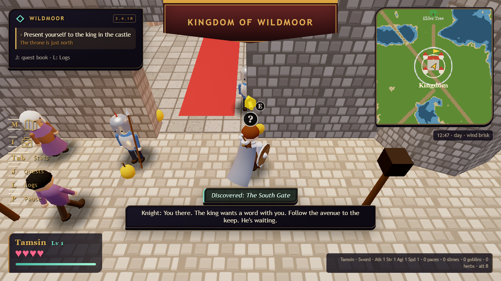
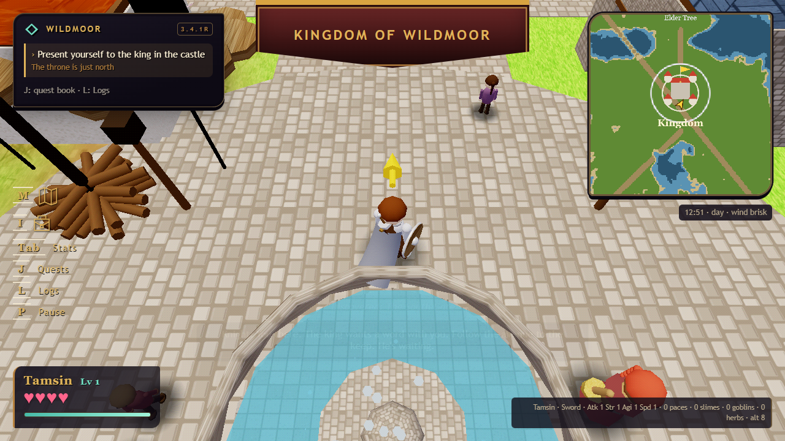
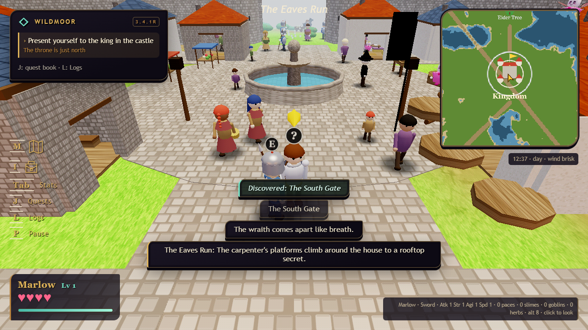
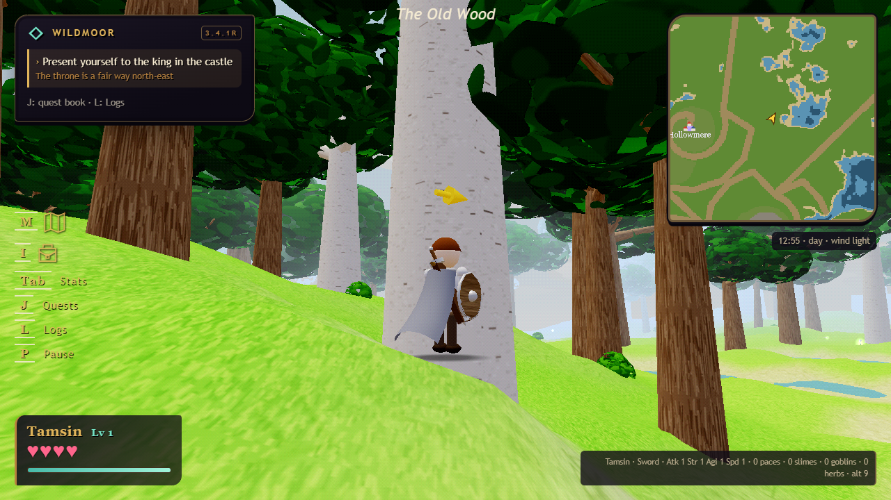
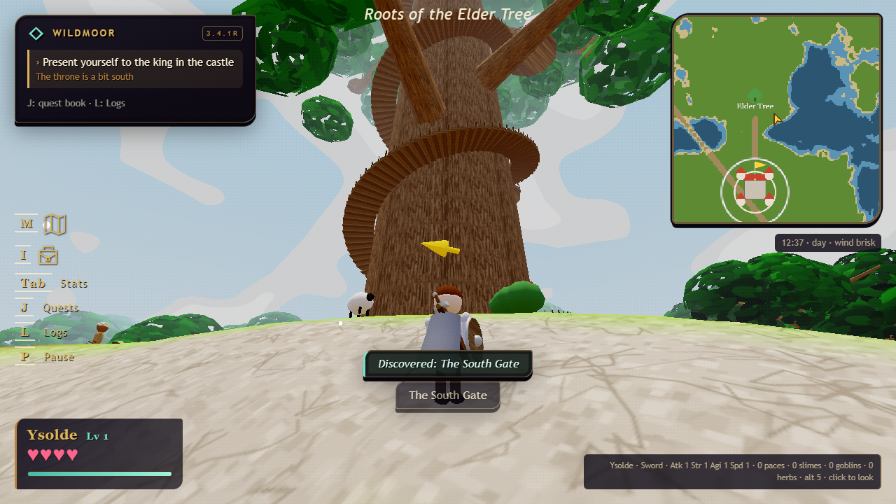
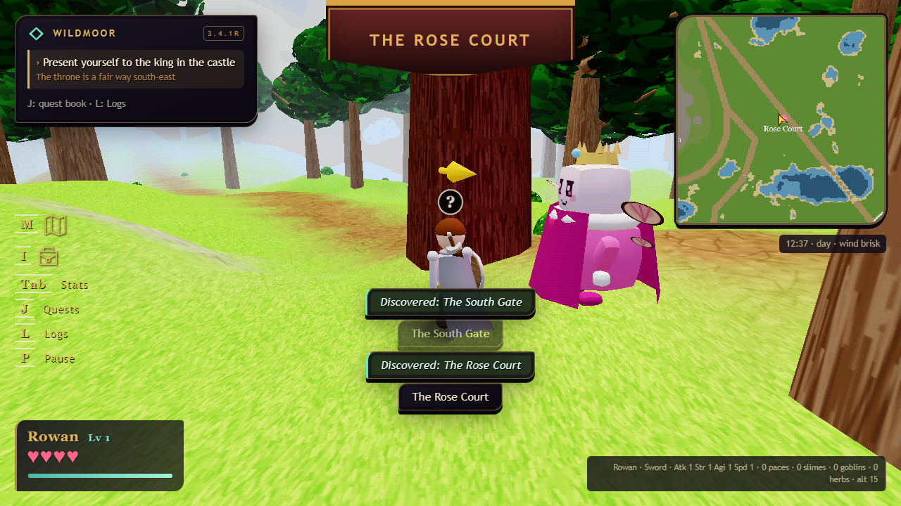

# 3.5 — solid trees, a dark doorway, and the square underfoot

[download the game](../../legend_of_wildmoor_v3.8.2.html) · [the retro edition](../../legend_of_wildmoor_v3.8.2_retro.html) · [test notes](../QA_3.5.md) · [changelog](../../CHANGELOG.md)

a fourth playthrough's reports, and a collision audit that found the trees had not been solid since 3.4. the pictures are the retro edition at its default native picture.

## the castle entrance

from the square the throne hall is a black doorway again. the box that was meant to hide it had never drawn a pixel — it was a back-face shell built a little larger than the hall's own inner walls, so every face of it lost the depth test — and the four wall torches burned at full strength day and night, so the throne room was in plain view through the door. the doorway is a curtain now, and the torches burn only while you are inside.

step in and it clears. the avenue's cobbles no longer lie over the hall's flagstones at the door (they stood two centimetres proud, and clipped the carpet short — that was the "carpet running out through the door" in the report), and the strip of grass at the foot of the wall on either side of the gate is cobbled: the cross streets reach under the wall.

## the square underfoot

every street slab stood eight to fourteen centimetres above the ground the villagers stand on, and the plaza thirteen — so the retro edition's shadow discs, six centimetres over the feet, were inside the stone, and came through only in grey slivers where the depth bias happened to win. the slabs sit two to four centimetres up now, the plaza four and a half, and the discs are soft painted circles rather than the eight-sided octagons the generator's halving had made of them. wolves and bog wraiths have a disc too.

every paved surface samples one world grid — four metres a cobble, phase from position, one tint — so where two slabs overlap, or the plaza laps over the avenue, there is no darker patch of finer stones with a hard edge any more. the plaza's disc is turned a quarter round to put its texture axis on x.

## the trees

the pale trees carry their own branches now, on the pale bark, instead of five oak branches over a birch trunk. and every tree in the valley is solid again: 3.4 wrote the other trunk mesh's empty slot into the scratch matrix one line before the trunk's base was read from it, so every tree's collision was centred on the world origin.

the elder tree's bark is drawn on the same profile the stair and the collision use. it was one cone the full height of the trunk, up to a metre wider than the wall the climber is pushed against.

## the rose queen

her cape wraps her side. the retro edition halves every round count, and at five sides it had hung out beside her in flat boards.

## the rest

- the Play tab of the pause menu resumes the game; the controls it fronted sit on a Controls tab, which the menu opens on.
- gehenna is raised at boot with the rest of the map in the main build too, as the retro edition has done since 3.1.
- lucifer stands your height when you first meet him, his shove takes exactly half of whatever you hold (not softened by level or guard; at one heart it takes the rest), and standing among the children while he holds the hand off mends you a little, visibly.
- the berry bushes push like the bush that is drawn; a struct within a body's width of a grid line no longer leaks; walls thicken with the rooms they are drawn in; the props pushed off the square by the swollen hall take their colliders with them and come all the way back.
- a kill line is not said twice when one swing takes two wraiths, and in a party the kill goes to whoever struck last.
- the test harness no longer takes the tester's mouse: the game's pointer-lock request is answered with nothing in the headless browser.
